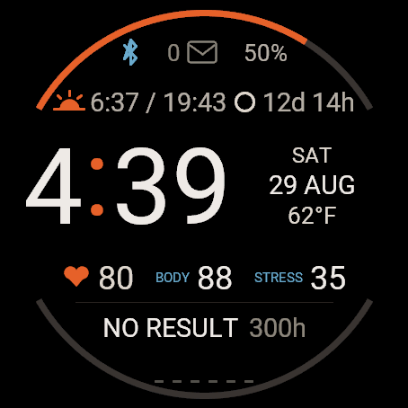

# Solar Arc

A Connect IQ watch face for the **Garmin Forerunner 965**.

On the dial: Bluetooth and notifications, battery, sunrise/sunset, moon countdown, time with date and temperature, heart rate, body battery, stress, training status, recovery, six-day step ticks, and solar / step arcs.

**This prebuilt file is for the Forerunner 965 only.** It will not run on a Venu 3 or any other Garmin.

## Install on a Forerunner 965

You do not need the Connect IQ SDK. Download the `.prg` and copy it onto the watch.

1. From **[Releases](https://github.com/crognlie/solar-arc/releases/latest)**, download **`SolarArc-fr965.prg`**.
2. Plug the watch into the computer with USB. Unlock it if it asks.
3. In File Explorer (Windows) or Finder, open the watch: **Forerunner 965 → Internal Storage → GARMIN → Apps**.
4. Copy `SolarArc-fr965.prg` into that **Apps** folder. Leave other files alone.
5. Eject the watch and unplug USB.
6. On the watch, hold **DOWN → Watch Face**, then scroll to **Solar Arc**.

If Solar Arc was already the face, switch to another face and back so the new file loads.

This is a sideload, not a Connect IQ Store install. Garmin will not update it for you.

### Settings

Hold **DOWN → Watch Face → Solar Arc → Settings**, or in the Garmin Connect phone app: **Device → Connect IQ Apps → Watch Faces → Solar Arc → Settings**.

You can change accent and data colors, the threshold palette, always-on, warm colors in Do Not Disturb, and the body-battery / stress thresholds.

## Building from source

The Connect IQ project is in [`watchface/garmin/`](watchface/garmin/). Layout notes and a local compile walkthrough are in [`watchface/garmin/README.md`](watchface/garmin/README.md). You need the Garmin SDK and your own developer key; a key from this repo is not included, and a `.prg` you compile yourself is a different app than the Release file unless you use the same key that signed it.
